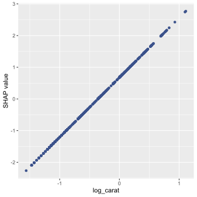
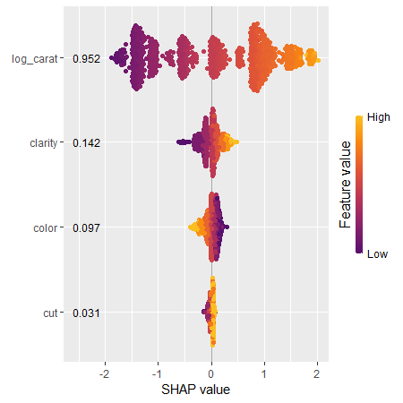
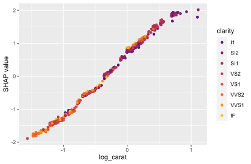
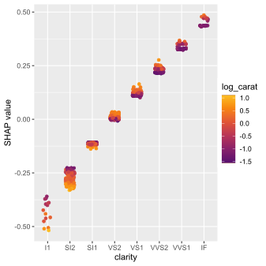

# permshap <a href='https://github.com/mayer79/permshap'></a>

<!-- badges: start -->

[](https://github.com/mayer79/permshap/actions)
[](https://www.tidyverse.org/lifecycle/#experimental)

<!-- badges: end -->

## Overview

This package crunches exact permutation SHAP values of any model with up to 16 features. Multi-output regressions and models with case-weights are handled at no additional cost.

Later, we will extend the project to more features and approximate algorithms.
The project emerged from a fork of our related project [kernelshap](https://github.com/ModelOriented/kernelshap).

The typical workflow to explain any model `object`:

1. **Sample rows to explain:** Sample 500 to 2000 rows `X` to be explained. If the training dataset is small, simply use the full training data for this purpose. `X` should only contain feature columns.
2. **Select background data:** Permutation SHAP requires a representative background dataset `bg_X` to calculate marginal means. For this purpose, set aside 50 to 500 rows from the training data.
If the training data is small, use the full training data. In cases with a natural "off" value (like MNIST digits), this can also be a single row with all values set to the off value.
3. **Crunch:** Use `permshap(object, X, bg_X, ...)` to calculate SHAP values. Runtime is proportional to `nrow(X)`, while memory consumption scales linearly in `nrow(bg_X)`.
4. **Analyze:** Use {shapviz} to visualize the result.

## Installation

```r
devtools::install_github("mayer79/permshap")
```

## Usage

Let's model diamonds prices!

### Linear regression

```r
library(ggplot2)
library(permshap)
library(shapviz)

diamonds <- transform(
  diamonds,
  log_price = log(price), 
  log_carat = log(carat)
)

fit_lm <- lm(log_price ~ log_carat + clarity + color + cut, data = diamonds)

# 1) Sample rows to be explained
set.seed(10)
xvars <- c("log_carat", "clarity", "color", "cut")
X <- diamonds[sample(nrow(diamonds), 1000), xvars]

# 2) Select background data
bg_X <- diamonds[sample(nrow(diamonds), 200), ]

# 3) Crunch SHAP values for all 1000 rows of X (~10 seconds)
system.time(
  shap_lm <- permshap(fit_lm, X, bg_X = bg_X)
)
shap_lm

# SHAP values of first 2 observations:
#       log_carat    clarity       color         cut
# [1,]  1.2692479  0.1081900 -0.07847065 0.004630899
# [2,] -0.4499226 -0.1111329  0.11832292 0.026503850

# 4) Analyze with shapviz >= 0.9.2 (Github install)
sv_lm <- shapviz(shap_lm)
sv_importance(sv_lm)
sv_dependence(sv_lm, "log_carat", color_var = NULL)
```




We can also explain a specific prediction instead of the full model:

```r
single_row <- diamonds[5000, xvars]

fit_lm |>
  permshap(single_row, bg_X = bg_X)
```

### Random forest

We can use the same `X` and `bg_X` to inspect other models:

```r
library(ranger)

fit_rf <- ranger(
  log_price ~ log_carat + clarity + color + cut, 
  data = diamonds, 
  num.trees = 20,
  seed = 20
)

shap_rf <- permshap(fit_rf, X, bg_X = bg_X)
shap_rf

# SHAP values of first 2 observations:
#       log_carat     clarity      color         cut
# [1,]  1.1986635  0.09557752 -0.1385312 0.001842753
# [2,] -0.4970758 -0.12034448  0.1051721 0.030014490

sv_rf <- shapviz(shap_rf)
sv_importance(sv_rf, kind = "bee", show_numbers = TRUE)
sv_dependence(sv_rf, "log_carat")
```





### Deep neural net

Or a deep neural net (results not fully reproducible):

```r
library(keras)

nn <- keras_model_sequential()
nn |>
  layer_dense(units = 30, activation = "relu", input_shape = 4) |>
  layer_dense(units = 15, activation = "relu") |>
  layer_dense(units = 1)

nn |>
  compile(optimizer = optimizer_adam(0.1), loss = "mse")

cb <- list(
  callback_early_stopping(patience = 20),
  callback_reduce_lr_on_plateau(patience = 5)
)
       
nn |>
  fit(
    x = data.matrix(diamonds[xvars]),
    y = diamonds$log_price,
    epochs = 100,
    batch_size = 400, 
    validation_split = 0.2,
    callbacks = cb
  )

pred_fun <- function(mod, X) 
  predict(mod, data.matrix(X), batch_size = 10000, verbose = FALSE)
shap_nn <- permshap(nn, X, bg_X = bg_X, pred_fun = pred_fun)

sv_nn <- shapviz(shap_nn)
sv_importance(sv_nn, show_numbers = TRUE)
sv_dependence(sv_nn, "clarity")
```



## Parallel computing

Parallel computing is supported via `foreach`, at the price of losing the progress bar. Note that this does not work with Keras models (and some others).

### Example: Linear regression continued

```r
library(doFuture)

# Set up parallel backend
registerDoFuture()
plan(multisession, workers = 4)  # Windows
# plan(multicore, workers = 4)   # Linux, macOS, Solaris

# ~4 seconds
system.time(
  s <- permshap(fit_lm, X, bg_X = bg_X, parallel = TRUE)
)
```

### Example: Parallel GAM

On Windows, sometimes not all packages or global objects are passed to the parallel sessions. In this case, the necessary instructions to `foreach` can be specified through a named list via `parallel_args`, see the following example:

```r
library(mgcv)

fit_gam <- gam(log_price ~ s(log_carat) + clarity + color + cut, data = diamonds)

system.time(
  shap_gam <- permshap(
    fit_gam, 
    X, 
    bg_X = bg_X,
    parallel = TRUE, 
    parallel_args = list(.packages = "mgcv")
  )
)

shap_gam

# SHAP values of first 2 observations:
#       log_carat    clarity       color         cut
# [1,]  1.2714988  0.1115546 -0.08454955 0.003220451
# [2,] -0.5153642 -0.1080045  0.11967804 0.031341595
```

## Meta-learning packages

Here, we provide some working examples for "tidymodels", "caret", and "mlr3".

### tidymodels

```r
library(tidymodels)
library(permshap)

iris_recipe <- iris %>%
  recipe(Sepal.Length ~ .)

reg <- linear_reg() %>%
  set_engine("lm")
  
iris_wf <- workflow() %>%
  add_recipe(iris_recipe) %>%
  add_model(reg)

fit <- iris_wf %>%
  fit(iris)
  
ps <- permshap(fit, iris[, -1], bg_X = iris)
ps
```

### caret

```r
library(caret)
library(permshap)
library(shapviz)

fit <- train(
  Sepal.Length ~ ., 
  data = iris, 
  method = "lm", 
  tuneGrid = data.frame(intercept = TRUE),
  trControl = trainControl(method = "none")
)

s <- permshap(fit, iris[, -1], predict, bg_X = iris)
s
```

### mlr3

```r
library(permshap)
library(mlr3)
library(mlr3learners)

# Regression
mlr_tasks$get("iris")
task_iris <- TaskRegr$new(id = "reg", backend = iris, target = "Sepal.Length")
fit_lm <- lrn("regr.lm")
fit_lm$train(task_iris)
s <- permshap(fit_lm, iris[-1], bg_X = iris)
s

# Probabilistic classification
task_iris <- TaskClassif$new(id = "class", backend = iris, target = "Species")
fit_rf <- lrn("classif.ranger", predict_type = "prob", num.trees = 50)
fit_rf$train(task_iris)
s <- permshap(fit_rf, X = iris[-5], bg_X = iris)
s
```

